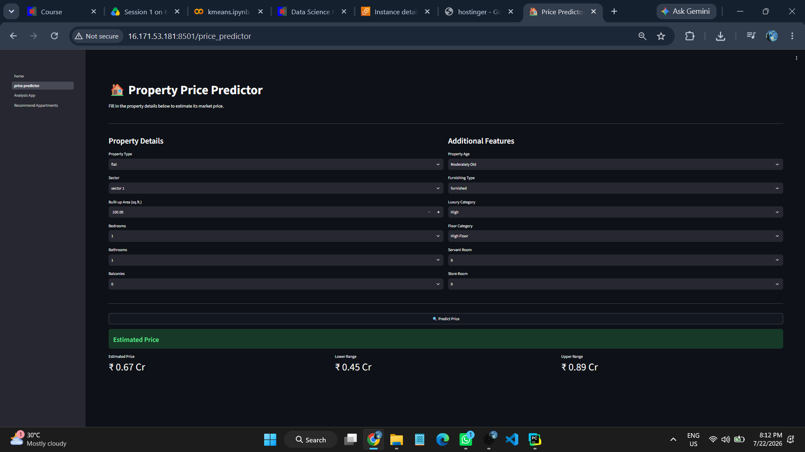
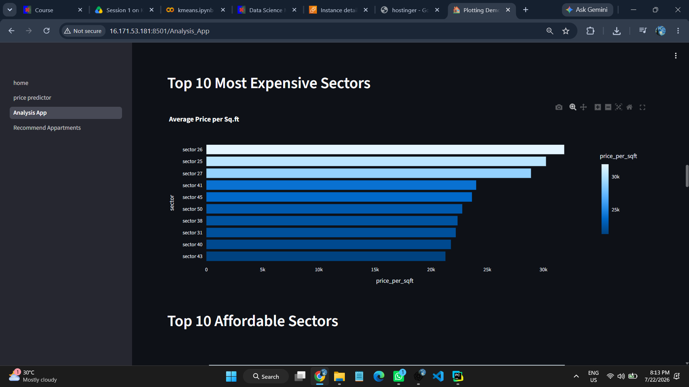
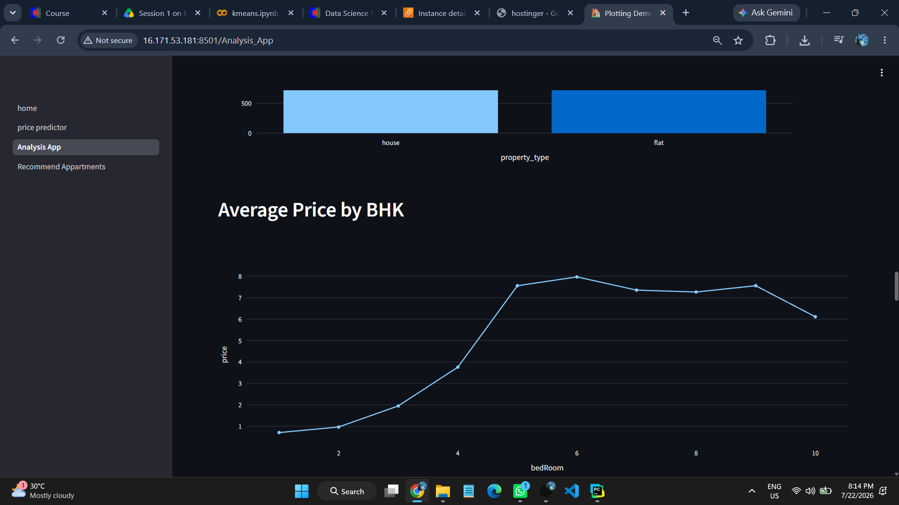
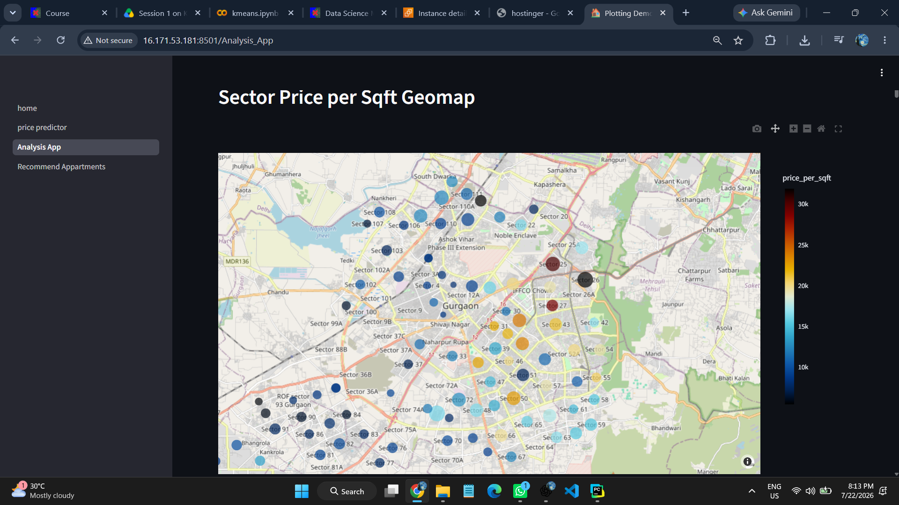
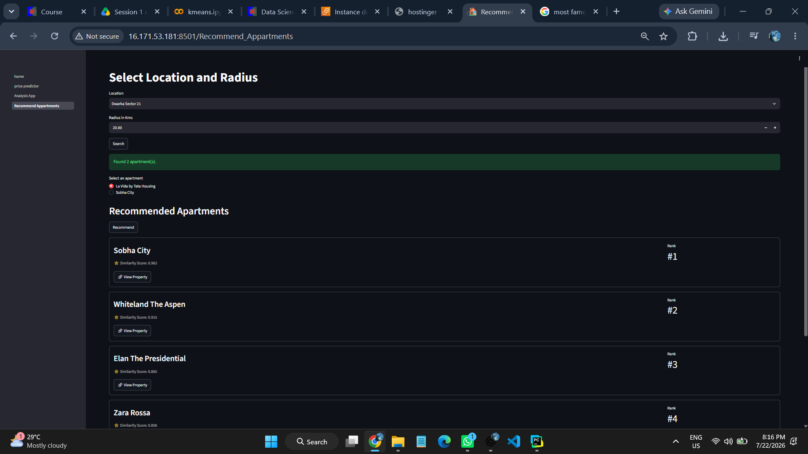
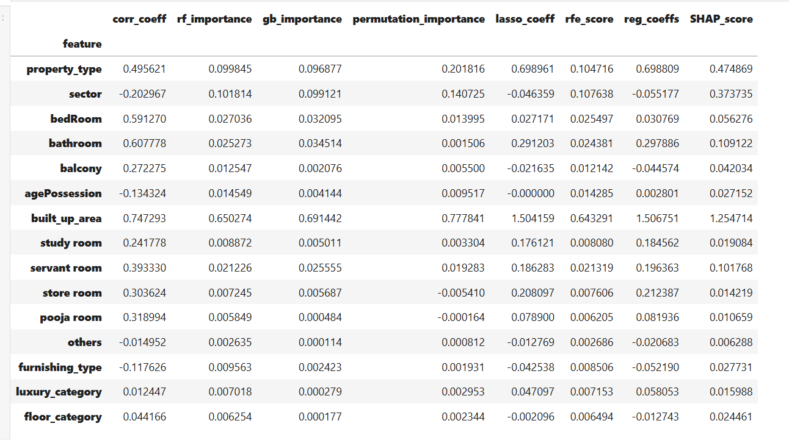
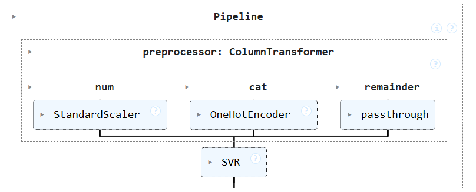
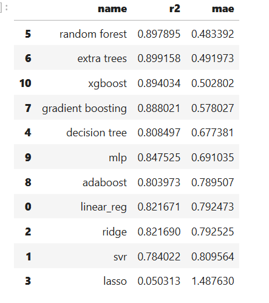
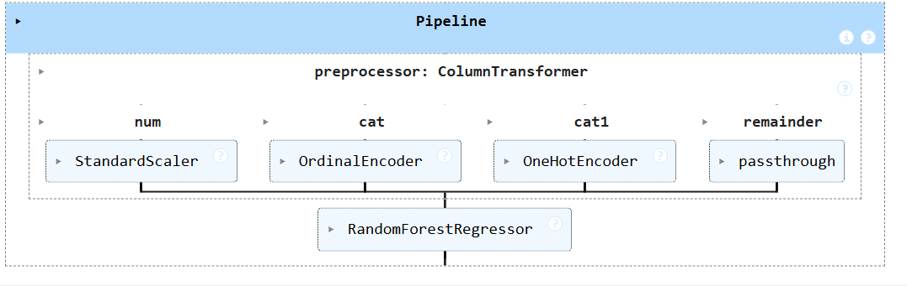

# 🏠 Real Estate Intelligence Platform

An end-to-end **Machine Learning** and **Data Analytics** platform for Gurgaon real estate that predicts property prices, provides interactive market insights, visualizes geographical trends, and recommends similar properties based on property features.


---

## 📑 Table of Contents

- 🌐 Live Demo
- 📸 Application Preview
- ✨ Features
- 🔄 Project Workflow
- 🌐 Streamlit Website
- ☁️ Deployment
- ⚙️ Tech Stack
- 📂 Project Structure
- ⚡ Installation
- 🚀 Future Improvements
- 📌 Important Note
- 👨‍💻 Author

---
## 🌐 Live Demo

🚀 **Live Application**

👉 http://16.171.53.181:8501

<sub>Hosted on AWS EC2 using Streamlit.</sub>

---
## 📸 Application Preview


### Home Page


### Price Prediction


### Analytics Dashboard


### Geo Map


### Recommendation System


---

# ✨ Features

## 🔮 House Price Prediction

Predict property prices using a trained Machine Learning model based on:

- Property Type
- Sector
- Bedrooms
- Bathrooms
- Built-up Area
- Balcony
- Furnishing Status
- Age of Property
- Luxury Category
- Floor Category
- Servant Room
- Store Room

---

## 📊 Analytics Dashboard

Interactive visualizations for understanding Gurgaon real estate market trends.

### Includes

- Sector-wise Price Analysis
- Interactive Geo Map
- Sector Feature Word Cloud
- Area vs Price Relationship
- BHK Distribution Analysis
- BHK Price Comparison
- Property Price Distribution
- House vs Flat Price Distribution
- Top 10 Premium Sectors
- Top 10 Affordable Sectors
- Property Type Distribution
- Average Price by BHK
- Luxury Category Analysis
- Furnishing Type Distribution
- Correlation Heatmap
- Feature Relationship Matrix
- Property Age vs Price Analysis
- Sector Comparison Tool
- Market Summary Dashboard
---

## 🗺️ Geo Map Analysis

Visualize Gurgaon sectors on an interactive map.

Features include:

- Sector-wise Average Price
- Price per Sq.ft
- Average Built-up Area
- Interactive Map using Plotly Mapbox

---

## 🏡 Property Recommendation System

Location Selection  
&nbsp;&nbsp;&nbsp;&nbsp;&nbsp;&nbsp;⬇️<br>
Radius-Based Apartment Search  
&nbsp;&nbsp;&nbsp;&nbsp;&nbsp;&nbsp;⬇️<br>
Apartment Selection  
&nbsp;&nbsp;&nbsp;&nbsp;&nbsp;&nbsp;⬇️<br>
Content-Based Recommendation Engine  
&nbsp;&nbsp;&nbsp;&nbsp;&nbsp;&nbsp;⬇️<br>
Weighted Cosine Similarity  
&nbsp;&nbsp;&nbsp;&nbsp;&nbsp;&nbsp;⬇️<br>
Top 5 Similar Apartment Recommendations  
&nbsp;&nbsp;&nbsp;&nbsp;&nbsp;&nbsp;⬇️<br>
Similarity Score + Direct Property Link
---
# 🔄 Project Workflow

## 📥 Data Gathering

Collected from **99 acre website** using **webscraping (beautifulsoup and selenium)** via

- `flats_appartment.ipynb`
- `residential_land.ipynb`
- `apartments.ipynb`

➡️ **Data:** `flats.csv`, `houses.csv`, `apartment.csv`

---

## 🧹 Data Cleaning

Cleaned data **`flats.csv`** via `flats_cleaning.ipynb`

➡️ `flats_cleaned.csv`

Cleaned data **`houses.csv`** via `houses_cleaning.ipynb`

➡️ `houses_cleaned.csv`

Merged **`flats_cleaned.csv`** and **`houses_cleaned.csv`** using `merge-flats-and-houses.ipynb`

➡️ `gurgaon_properties.csv`

Cleaned one more round **`gurgaon_properties.csv`** via `final_cleaning.ipynb`

➡️ `gurgaon_properties_cleaned_v1.csv`

---

## ⚙️ Feature Engineering

Performed feature engineering on the following features:
- `areaWithType`
- `additional rooms`
- `age possessions`
- `furnish details`
- `features`
- `luxary_category`

via `feature_engineering.ipynb`

➡️ `gurgaon_properties_cleaned_v2.csv`

---

## 📊 EDA

**Univariate analysis** via `EDA-univariate.ipynb`

**Pandas profiling** via `EDA-pandas_profiling.ipynb`

➡️ `output_report.html`

**Multivariate analysis** via `EDA-multivariate.ipynb`

---

## 📌 Outlier Treatment

via `outlier_treatment.ipynb`

➡️ `gurgaon_properties_outlier_treated.csv`

---

## 🩹 Missing Value Treatment

via `missing-value-imputation.ipynb`

➡️ `gurgaon_properties_outlier_treated.csv`

---

## 🎯 Feature Selection

Using **8 different techniques** via `feature_selection.ipynb`

1. Correlation Analysis
2. Random Forest Feature Importance
3. Gradient Boosting Feature importances
4. Permutation Importance
5. LASSO
6. RFE
7. Linear Regression Weights
8. SHAP

### 📈 Performance



Finally dropped some columns like

- `pooja room`
- `study room`
- `others`

➡️ `gurgaon_properties_feature_selection.csv`

➡️ `gurgaon_properties_feature_selectionV2.csv`

---

## 🤖 Baseline Model

Encode categorical column, scaling features and log transformations and fitting the pipeline using **SVR** and **linear regression** algorithm via `baseline_model.ipynb`

### 📈 Performance



Using **k-fold cross validation** for baseline model

- **R² score:** `0.8832604429`
- **Std:** `0.008881066421`
- **MAR:** `0.5371884491`

---

## 🏆 Model Selection

Tried **3 encoding techniques** via `model_selection.ipynb`

- Ordinal Encoding
- One Hot Encoding (with/without PCA)
- Target Encoder

with **11 different algorithms**

- Linear Regression
- SVR
- Ridge
- Lasso
- Decision Trees
- Random Forest
- Extra Trees
- Gradient Boosting
- AdaBoost
- MLP
- XGBoost

and measure **R2 score** and **mean absolute error (MAE)**

### 📈 Performance



Also done **hyperparameter tuning** and selected the **random forest regressor** as best model out of it.

➡️ `pipeline.pkl`

➡️ `df.pkl`

### 🥇 Final Pipeline



# 📈 Model Performance
Final model selected after hyperparameter tuning using Random Forest Regressor.

| Metric | Score                |
|---------|----------------------|
| R² Score | *0.8977429950582* |
| MAE | *0.4823821233445*    |

---

## 🌐 Streamlit Website

### 🏠 Price Predictor Page

Used **`pipeline.pkl`** and **`df.pkl`** to create **price predictor page**.

### 📊 Analytics Module Page

Created via `data_visualiztion.ipynb`

➡️ `data_viz1.csv`

Created an interactive geo map through latitude and longitude for each sector using **Geopy** via `latlong_scraper.py`

➡️ `Gurgaon_sector_coordinates.csv`

Used wordcloud for representing important features in each sector

➡️ `sector_features.pkl`

**10 other visualization**

### 🏢 Recommender System Page

Developed a location-based property recommendation system for apartments using **`apartments.csv`**

Weightage based on **3 factors**

1. Top facilities ➡️ `cosine_sim1.pkl`
2. Price details info ➡️ `cosine_sim2.pkl`
3. Nearby locations ➡️ `cosine_sim3.pkl`

First fetch apartments in desired nearby locations using **`location_df.pkl`**

Then recommend top **5 apartment** on chosen apartments through **weightage based 3 mixed recommender system**.

## ☁️ Deployment

The application is deployed on **AWS EC2** using:

- Ubuntu Linux Server
- Python Virtual Environment
- Streamlit
- SSH
- Git
- GitHub

Deployment Workflow:

```
GitHub
      ↓
AWS EC2 (Ubuntu)
      ↓
Python Virtual Environment
      ↓
Streamlit
      ↓
Live Web Application
```

# ⚙️ Tech Stack

### Programming Language

- Python

### Machine Learning

- Scikit-learn
- Random Forest Regressor
- Pipeline
- ColumnTransformer
- StandardScaler
- OneHotEncoder
- OrdinalEncoder

### Data Analysis

- Pandas
- NumPy

### Visualization

- Plotly
- Matplotlib
- seaborn
- wordcloud

### Geospatial

- Geopy

### Web Framework

- Streamlit

### Web scraping
- beautifulsoup
- selenium

### Deployment

- AWS EC2
- Ubuntu Linux
- Python Virtual Environment
- systemd (Service Management)
- SSH
- Git
- GitHub

---

# 📂 Project Structure

```
RealEstate-Intelligence-Platform/
│
├── home.py
├── pages/
│   ├── Price_Predictor.py
│   ├── Analytics.py
│   ├── Geo_Map.py
│   └── Recommendation.py
│
├── datasets/
│
├── df.pkl
├── requirements.txt
├── model_training.ipynb
├── README.md
├── screenshots/
└── .gitignore
```

---

# ⚡ Installation

Clone the repository

```bash
git clone https://github.com/kush10521/RealEstate-Intelligence-Platform.git

cd RealEstate-Intelligence-Platform
```

Create Virtual Environment

```bash
python -m venv venv
```

### Windows

```bash
venv\Scripts\activate
```

### Linux / Mac

```bash
source venv/bin/activate
```

Install Dependencies

```bash
pip install -r requirements.txt
```

Run Streamlit

```bash
streamlit run home.py --server.port 8501
```

---


# 🚀 Future Improvements

- User Authentication
- Rental Price Prediction
- Property Comparison
- Advanced Recommendation Engine
- AI Chatbot for Property Assistance
- Market Trend Forecasting
- Cloud Database Integration

---

# 📌 Important Note

The trained model (`pipeline.pkl`) is **not included** in this repository because it exceeds GitHub's **100 MB** file size limit.

You can regenerate the trained model by running:

```bash
model_selection.ipynb
```

---

# 👨‍💻 Author

## Kush Singh

B.Tech in Computer Science & Engineering,
Madan Mohan Malaviya University of Technology, Gorakhpur

### Connect with Me

- **GitHub:** https://github.com/kush10521
- **LinkedIn:** https://www.linkedin.com/in/kush-singh-1b2788328/
---

# ⭐ Support

If you found this project useful, please consider giving it a **⭐ Star** on GitHub.

It helps others discover the project and motivates future improvements.

---

## 📬 Contact

If you'd like to discuss this project, collaborate, or provide feedback, feel free to connect via GitHub or LinkedIn.